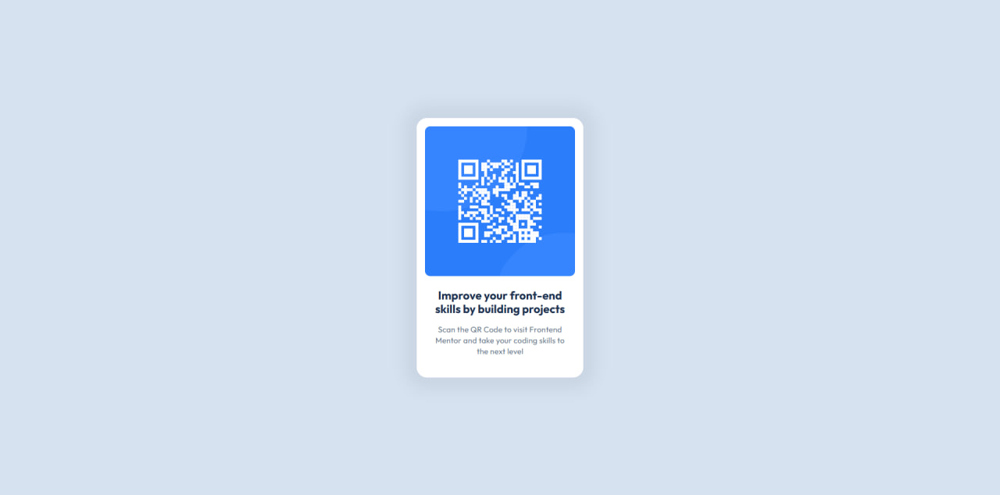
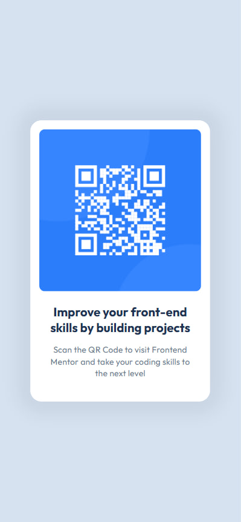

# Frontend Mentor - QR code component solution

This is a solution to the [QR code component challenge on Frontend Mentor](https://www.frontendmentor.io/challenges/qr-code-component-iux_sIO_H). Frontend Mentor challenges help you improve your coding skills by building realistic projects.

## Table of contents

- [Overview](#overview)
  - [Screenshot](#screenshot)
  - [Links](#links)
- [My process](#my-process)
  - [Built with](#built-with)
  - [What I learned](#what-i-learned)
  - [Useful resources](#useful-resources)
- [Author](#author)

## Overview

### Screenshot

### Links

- Solution URL: [https://github.com/Arlikey/qr-code-component.git](https://github.com/Arlikey/qr-code-component.git)
- Live Site URL: [https://arlikey.github.io//qr-code-component](https://arlikey.github.io/qr-code-component)

## My process

### Built with

- Semantic HTML5 markup
- CSS custom properties
- Flexbox
- BEM CSS methodology
- Desktop-first workflow
- [Angular](https://angular.dev/) - Project Environment
- [SCSS](https://sass-lang.com/) - CSS Preprocessor

### What I learned

Previously I mainly worked with React and Tailwind, but this project was a shift toward Angular + SCSS with BEM methodology.

Essentially, Angular doesn't play a role in this project; it's more a matter of HTML structure and semantics, as well as styles.

Key things I focused on:

- Writing semantic HTML using `<main>` and `<article>` correctly
- Structuring styles using BEM naming convention
- Using SCSS nesting for component-level organization
- Creating reusable design tokens with CSS custom properties
- Building a simple layout using Flexbox

### Useful resources

- [MDN Web Docs](https://developer.mozilla.org/) - reference for HTML/CSS behavior and specifications.
- [web.dev](https://web.dev/learn/) - structured learning material for modern frontend concepts.

## Author

- LinkedIn - [Nazar Melnyk](https://www.linkedin.com/in/nazar-melnyk-a347493a3)
- Frontend Mentor - [@Arlikey](https://www.frontendmentor.io/profile/Arlikey)
